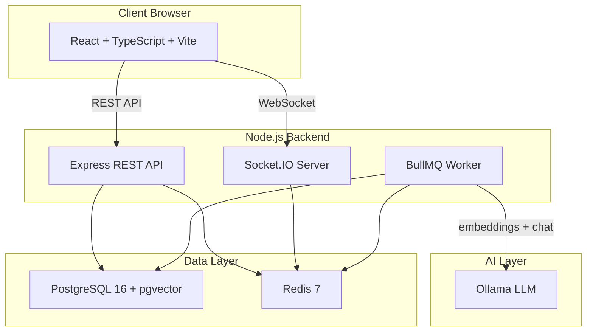

# NexusOps

**AI-powered, real-time IT Operations & Incident Management Platform.**

NexusOps is an enterprise-style IT service management platform built on a fully open-source stack: incident, problem, change, asset & knowledge management, role-based access control, audit logging, real-time collaboration (WebSockets/Socket.IO), and a local-first AI layer backed by **Ollama** (no paid AI APIs required).

> **Status: Complete.** All core modules (incidents, assets, knowledge, problems, changes), real-time collaboration, AI layer, RBAC, audit logging, secure file uploads, full documentation, E2E test infrastructure, and production Docker deployment are built and tested.

---

## Why NexusOps?

IT operations teams struggle with fragmented tools: one system for tickets, another for assets, a separate knowledge base, and no intelligent assistance for diagnosing incidents. NexusOps unifies all of these into a single, cohesive platform.

**The problem:** When an incident occurs, technicians waste time searching through documentation, manually categorizing tickets, and duplicating work on similar past issues. Meanwhile, managers lack real-time visibility into team workload and SLA compliance.

**The solution:** NexusOps combines traditional ITSM workflows with modern AI assistance. Incidents are automatically classified and prioritized using local AI models. The RAG-powered knowledge assistant surfaces relevant documentation in real time. Semantic duplicate detection prevents redundant work. And everything updates live via WebSockets — no page refreshes needed.

**The value:** Faster resolution times, consistent categorization, knowledge reuse, and full auditability — all running on infrastructure you control, with no vendor lock-in and no per-seat licensing fees.

---

## Architecture



---

## Tech Stack

| Layer | Technology |
|---|---|
| Frontend | React 18, TypeScript, Vite 5, React Router, hand-rolled CSS design system |
| Backend | Node.js, Express, TypeScript, Socket.IO |
| Database | PostgreSQL 16 + pgvector (Prisma ORM) |
| Cache/Queue | Redis 7 (caching, real-time, BullMQ job queue) |
| AI | Ollama (local LLM + embeddings) — optional, graceful fallback |
| Testing | Vitest, Supertest, Playwright (roadmap) |
| CI/CD | GitHub Actions |
| Infra | Docker + Docker Compose |

---

## Project Metrics

| Metric | Count |
|---|---|
| RBAC Roles | 4 (ADMIN, IT_MANAGER, TECHNICIAN, EMPLOYEE) |
| Fine-grained Permissions | 18 |
| Incident Statuses | 9 (OPEN, ASSIGNED, IN_PROGRESS, WAITING_FOR_USER, WAITING_FOR_VENDOR, RESOLVED, CLOSED, REOPENED) |
| Incident Priorities | 4 (LOW, MEDIUM, HIGH, CRITICAL) |
| Incident Categories | 10 (NETWORK, HARDWARE, SOFTWARE, SECURITY, ACCOUNT, EMAIL, SERVER, DATABASE, VPN, OTHER) |
| Database Models | 25+ |
| API Modules | 11 (auth, incidents, notifications, assets, knowledge, problems, changes, ai, uploads, audit, admin) |
| Real-time Event Types | 8 (ticket:created, ticket:updated, ticket:comment, notification:new, ai:analysis, ai:status, presence:update) |
| Automated Tests | 44 (backend unit + integration) |
| AI Capabilities | Classification, priority recommendation, cause analysis, troubleshooting steps, duplicate detection, RAG Q&A |

---

## Features

### Incident Management
- Full lifecycle: create → assign → progress → resolve → close → reopen
- SLA deadlines with automatic breach detection
- Priority-based escalation (CRITICAL 1h, HIGH 4h, MEDIUM 8h, LOW 24h)
- Status transition validation (state machine)
- Comments with real-time delivery
- File attachments with magic byte validation
- Complete history trail

### AI-Powered Analysis
- Automatic incident classification and priority recommendation
- Possible cause analysis and troubleshooting steps
- Semantic duplicate detection (pgvector cosine similarity)
- RAG-powered knowledge assistant with cited sources
- Graceful fallback to keyword heuristics when AI is unavailable

### Real-Time Collaboration
- WebSocket-based live updates (no page refreshes)
- Incident comments broadcast instantly
- Notification delivery with unread counts
- User presence indicators (online/away/offline)
- Room-based event routing (user, role, department, ticket)

### Asset Management
- Full asset lifecycle tracking
- Assignment to users and departments
- Warranty and purchase tracking
- Multiple asset types (laptop, desktop, server, network, monitor)

### Knowledge Base
- Article workflow (draft → review → published → archived)
- Semantic search via embeddings
- Category and tag organization
- View count tracking

### Problem & Change Management
- Problem linking to incidents
- Change request workflow with approvals
- CAB (Change Advisory Board) approval process

### Security & Compliance
- JWT authentication with refresh token rotation
- Role-based access control (RBAC) with fine-grained permissions
- Password hashing (bcrypt, cost factor 12)
- Rate limiting (general + auth-specific)
- Helmet security headers
- CORS configuration
- Immutable audit logging
- Secure file uploads (magic byte validation, type restrictions)

---

## Screenshots

| Login | Dashboard |
|---|---|
|  |  |

| Incidents List | Incident Detail |
|---|---|
|  |  |

| AI Analysis | Knowledge Base |
|---|---|
|  |  |

| Assets | Admin Panel |
|---|---|
|  |  |

> **Note:** To capture screenshots, run the application locally and navigate to each page. Save PNG images to `docs/screenshots/` with the filenames shown above.

---

## Prerequisites

- **Docker Desktop** (WSL2 backend on Windows)
- **Node.js ≥ 20** (v22 recommended)
- **Ollama** (optional; required only for the AI features in Phase 6)

## Installation & Local Development

```bash
cd nexusops

# 1. Start infrastructure (PostgreSQL 16 + pgvector, Redis 7)
docker compose up -d postgres redis

# 2. Install dependencies (npm workspaces)
npm install

# 3. Prepare environment
cp .env.example .env          # then fill in real secrets (see "Environment" below)
# Also copy to backend/.env so Prisma CLI (run from backend/) can read it.

# 4. Create the database schema (creates the pgvector extension too)
cd backend
npx prisma migrate dev        # applies migrations + generates client

# 5. Seed realistic demo data
npx tsx prisma/seed.ts

# 6. Run the API (terminal 1)
npm run dev --workspace backend

# 7. Run the frontend (terminal 2)
npm run dev --workspace frontend
```

Open **http://localhost:5173** (frontend) — the Vite dev server proxies `/api` to the backend on `:4000`.

## Demo Accounts

Password for **all** demo accounts is `Password123!`:

| Role | Email |
|---|---|
| Admin | `admin@nexusops.local` |
| IT Manager | `manager@nexusops.local` |
| Technician | `tech1@nexusops.local` / `tech2@nexusops.local` |
| Employee | `employee@nexusops.local` / `employee2@nexusops.local` |

## Environment Variables

See `.env.example` for the full template (no real secrets are committed). Key variables:

| Variable | Purpose |
|---|---|
| `DATABASE_URL` | PostgreSQL connection string |
| `REDIS_URL` | Redis connection string |
| `JWT_ACCESS_SECRET` / `JWT_REFRESH_SECRET` | Signing secrets (generate long random values) |
| `ENCRYPTION_KEY` | 32-byte hex key for sensitive fields at rest |
| `OLLAMA_BASE_URL` / `OLLAMA_CHAT_MODEL` / `OLLAMA_EMBED_MODEL` | Local AI configuration |
| `AI_ENABLED` | Master switch for AI features |

## Docker

```bash
# Infrastructure only (development)
docker compose up -d postgres redis

# Full stack (production — backend + frontend + infra)
docker compose up -d
```

The frontend is served on port 80 (nginx) and proxies `/api` to the backend on port 4000. The frontend and backend application services are built via multi-stage Dockerfiles.

## Tests

```bash
npm run test:backend                 # Vitest unit + integration
npm run typecheck --workspace backend
npm run typecheck --workspace frontend
npm run build                        # full workspace build
```

## Roadmap

- **Phase 0 (DONE):** Monorepo, Docker infra, schema, migrations, seed, CI skeleton
- **Phase 1 (DONE):** Authentication & RBAC (JWT access/refresh, roles/permissions, middleware, audit)
- **Phase 2 (DONE):** Incident management core + SLA engine
- **Phase 3 (DONE):** Real-time layer (Socket.IO, notifications, presence)
- **Phase 4 (DONE):** Frontend shell + design system + role dashboards
- **Phase 5 (DONE):** Assets, Knowledge, Problems, Changes (full CRUD + workflows)
- **Phase 6 (DONE):** AI layer (Ollama, classification, RAG assistant, duplicate detection)
- **Phase 7 (DONE):** Secure file uploads + security hardening (audit review, admin panel)
- **Phase 8 (DONE):** Documentation suite + E2E test infrastructure

Full architecture & design documentation lives in `docs/`.

## Live Demo

> **Frontend:** `<DEPLOYED_FRONTEND_URL>`
> **Backend:** `<DEPLOYED_BACKEND_URL>`

(Deploy to your preferred cloud provider — see `docs/deployment.md` for free-tier options.)

## License

MIT.