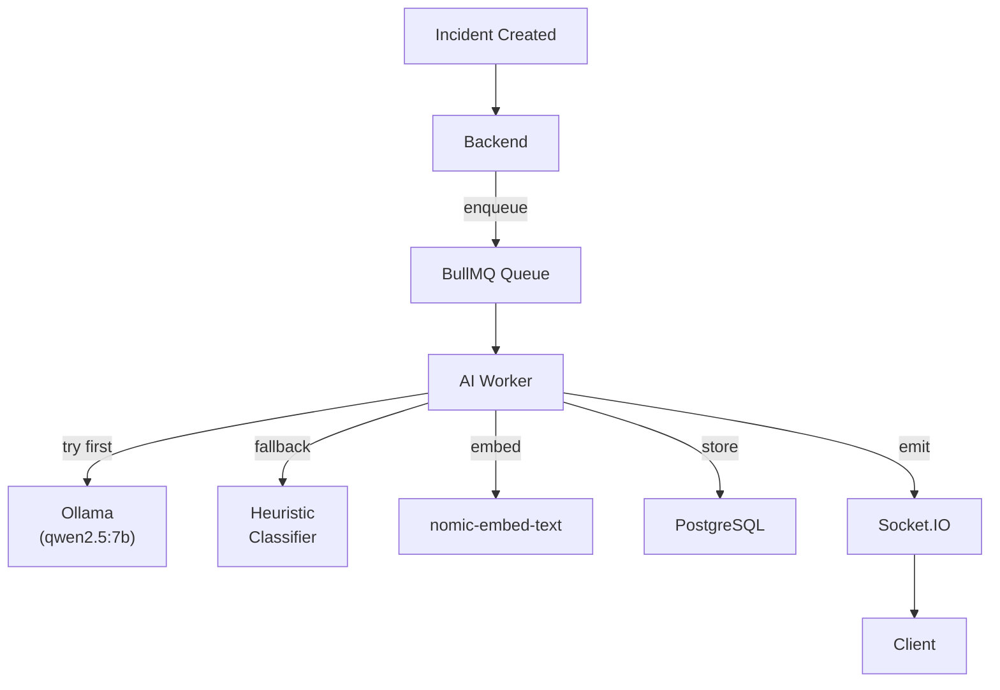
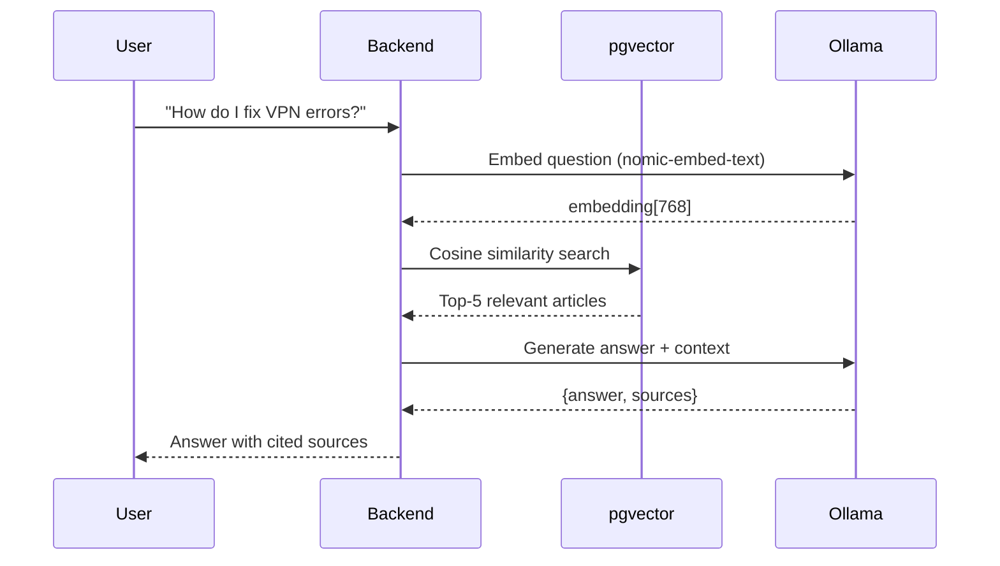

# AI Layer

NexusOps integrates AI as an **enhancement**, not a dependency. The core platform works fully without AI — the AI layer adds intelligence when available.

## Design Principles

1. **AI is never authoritative** — recommendations require human acceptance
2. **Graceful degradation** — the app works fully without any LLM running
3. **No paid APIs** — 100% local inference via Ollama
4. **Transparent sources** — RAG answers cite their sources; refuse when no sources exist

## Architecture



## LlmProvider Abstraction

The AI layer is decoupled from any specific model behind a `LlmProvider` interface:

```typescript
interface LlmProvider {
  chat(system: string, user: string): Promise<{ content: string }>;
  embed(text: string): Promise<number[]>;
}
```

| Provider | When used |
|---|---|
| `OllamaProvider` | AI_ENABLED=true and Ollama reachable |
| `MockProvider` | AI disabled — returns safe defaults |
| Heuristic fallback | Ollama returns invalid/unparseable output |

## Incident Analysis Pipeline

When an incident is created:

1. **Enqueue** — Backend saves incident, returns 201 immediately, enqueues `ai-analysis` job
2. **Classify** — Worker calls Ollama to determine category, priority, root cause, suggested actions
3. **Embed** — Generate embedding vector for duplicate detection
4. **Find duplicates** — pgvector cosine similarity search against past incidents
5. **Store** — Save result in `ai_interactions` table
6. **Notify** — Emit `ai:analysis` via Socket.IO to the incident's room

### Analysis Output

```json
{
  "category": "VPN",
  "priority": "HIGH",
  "summary": "VPN connection failing after Windows update",
  "possibleCause": "VPN client compatibility issue with the latest update",
  "suggestedActions": [
    "Check VPN client version",
    "Restart VPN service",
    "Verify credentials",
    "Check network configuration"
  ],
  "recommendedDepartment": "Network Operations",
  "duplicateIncidents": [
    { "ref": "INC-1042", "similarity": 0.89 }
  ]
}
```

## Heuristic Fallback

When Ollama is unavailable, a keyword-based classifier provides reasonable defaults:

```typescript
const KEYWORDS = {
  VPN: ['vpn', 'virtual private', 'tunnel'],
  HARDWARE: ['screen', 'keyboard', 'laptop', 'broken'],
  SOFTWARE: ['app', 'crash', 'install', 'update'],
  NETWORK: ['wifi', 'internet', 'connection', 'network'],
  // ...
};
```

This ensures **the app never breaks** without AI.

## Retrieval-Augmented Generation (RAG)

The AI knowledge assistant uses RAG to answer questions using company documentation:



### Anti-Hallucination Guard

If no relevant articles are found (similarity below threshold), the system **refuses to answer**:

> "I could not find relevant documentation to answer this question. Please try rephrasing or contact your IT team."

This prevents the AI from pretending it knows something it doesn't.

## Vector Search (pgvector)

Embeddings are stored in `vector(768)` columns with **HNSW** indexes for fast approximate nearest-neighbor search:

```sql
-- Cosine similarity search
SELECT article_id, 1 - (embedding <=> $query_embedding) AS similarity
FROM knowledge_embeddings
ORDER BY embedding <=> $query_embedding
LIMIT 5;
```

| Component | Details |
|---|---|
| Embedding model | `nomic-embed-text` (768 dimensions) |
| Index type | HNSW (hierarchical navigable small world) |
| Distance operator | `<=>` (cosine distance) |
| Table | `knowledge_embeddings` |

## Background Jobs (BullMQ)

| Queue | Purpose |
|---|---|
| `ai-analysis` | Incident classification |
| `ai-summary` | Long conversation summarization |
| `embeddings` | Knowledge article embedding |
| `duplicate-detection` | Similarity search for new incidents |

Jobs are processed by a dedicated worker process and support:
- **Retries** — up to 3 attempts with exponential backoff
- **Concurrency** — configurable parallelism
- **Progress tracking** — client sees "Queued → Processing → Done"

## Model Recommendations

| Hardware | Recommended model | Notes |
|---|---|---|
| 16 GB RAM + GPU (4GB+ VRAM) | `qwen2.5:7b` | Partial GPU offload, good JSON compliance |
| 8 GB RAM, no GPU | `qwen2.5:3b` | CPU-only, slower but functional |
| 32 GB+ RAM + strong GPU | `qwen2.5:14b` | Best quality, needs 8GB+ VRAM |

**Embeddings** always use `nomic-embed-text` (~274 MB) — fast on any hardware.

## AI Safety Rules

1. **AI never modifies the database directly** — it produces recommendations stored in `ai_interactions`; humans decide
2. **AI never approves changes, closes incidents, or grants permissions** — these require human action
3. **AI outputs are labeled** — the UI clearly marks AI-generated content
4. **AI hallucinations are contained** — RAG refuses to answer without sources; outputs are Zod-validated
5. **AI can be disabled** — set `AI_ENABLED=false` and the app runs on heuristic fallback
