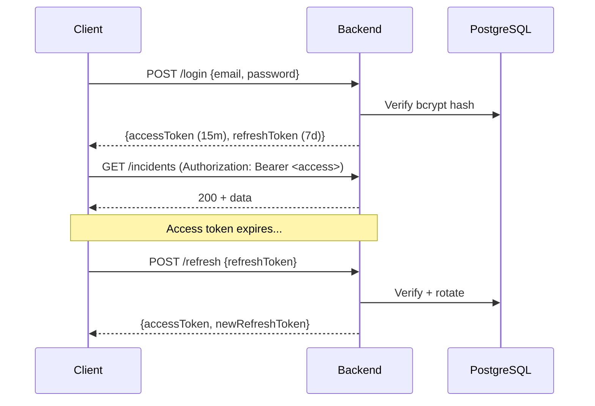

# API Reference

NexusOps exposes a RESTful JSON API with consistent response envelopes and standardized error codes.

## Response Format

All responses follow a consistent envelope:

```json
// Success (single resource)
{
  "success": true,
  "data": { "id": "...", "title": "..." }
}

// Success (paginated list)
{
  "success": true,
  "data": {
    "items": [...],
    "total": 42,
    "page": 1,
    "pageSize": 20
  }
}

// Error
{
  "success": false,
  "message": "Incident not found",
  "code": "INCIDENT_NOT_FOUND"
}
```

## Authentication

| Endpoint | Method | Auth | Description |
|---|---|---|---|
| `/api/auth/register` | POST | Public | Create account |
| `/api/auth/login` | POST | Public | Login, receive tokens |
| `/api/auth/logout` | POST | Bearer | Revoke refresh token |
| `/api/auth/refresh` | POST | Public | Rotate refresh token |
| `/api/auth/forgot-password` | POST | Public | Request reset token |
| `/api/auth/reset-password` | POST | Public | Set new password |
| `/api/auth/me` | GET | Bearer | Current user profile |

### Token Flow



Access tokens expire in **15 minutes**. Refresh tokens expire in **7 days** and are rotated on each use (old token revoked).

## Incidents
| `order` | string | asc or desc |

## Assets

| Endpoint | Method | Permission | Description |
|---|---|---|---|
| `/api/assets` | GET | Authenticated | List with filters |
| `/api/assets` | POST | `ASSET_CREATE` | Create asset |
| `/api/assets/:id` | GET | Authenticated | Get detail |
| `/api/assets/:id` | PATCH | `ASSET_MANAGE` | Update asset |
| `/api/assets/:id/assign` | POST | `ASSET_MANAGE` | Assign to user |
| `/api/assets/:id/unassign` | POST | `ASSET_MANAGE` | Unassign |

## Knowledge

| Endpoint | Method | Permission | Description |
|---|---|---|---|
| `/api/knowledge` | GET | Authenticated | List with filters |
| `/api/knowledge` | POST | `KNOWLEDGE_CREATE` | Create article |
| `/api/knowledge/:id` | GET | Authenticated | Get detail |
| `/api/knowledge/:id` | PATCH | `KNOWLEDGE_MANAGE` | Update article |
| `/api/knowledge/:id/publish` | POST | `KNOWLEDGE_APPROVE` | Publish article |

## Problems

| Endpoint | Method | Permission | Description |
|---|---|---|---|
| `/api/problems` | GET | Authenticated | List problems |
| `/api/problems` | POST | `PROBLEM_MANAGE` | Create problem |
| `/api/problems/:id` | GET | Authenticated | Get detail |
| `/api/problems/:id` | PATCH | `PROBLEM_MANAGE` | Update problem |
| `/api/problems/:id/link-incident` | POST | `PROBLEM_MANAGE` | Link incident |
| `/api/problems/:id/unlink-incident` | POST | `PROBLEM_MANAGE` | Unlink incident |

## Changes

| Endpoint | Method | Permission | Description |
|---|---|---|---|
| `/api/changes` | GET | Authenticated | List changes |
| `/api/changes` | POST | `CHANGE_CREATE` | Create change request |
| `/api/changes/:id` | GET | Authenticated | Get detail |
| `/api/changes/:id/transition` | POST | `CHANGE_MANAGE` | Advance workflow |
| `/api/changes/:id/approve` | POST | `CHANGE_APPROVE` | Approve or reject |

### Change Workflow

```
DRAFT → SUBMITTED → UNDER_REVIEW → APPROVED → SCHEDULED → IMPLEMENTING → COMPLETED
                              ↘ REJECTED → DRAFT (edit + resubmit)
```

## Notifications

| Endpoint | Method | Description |
|---|---|---|
| `/api/notifications` | GET | List user notifications |
| `/api/notifications/unread-count` | GET | Get unread count |
| `/api/notifications/:id/read` | PATCH | Mark as read |
| `/api/notifications/read-all` | POST | Mark all as read |

## AI

| Endpoint | Method | Permission | Description |
|---|---|---|---|
| `/api/ai/incidents/:id/analysis` | GET | Authenticated | Get AI analysis result |
| `/api/ai/incidents/:id/reanalyze` | POST | `AI_REANALYZE` | Re-trigger analysis |
| `/api/ai/incidents/:id/ai-decision` | POST | `AI_MANAGE` | Accept/reject AI recommendation |
| `/api/ai/ask` | POST | Authenticated | RAG question → answer + sources |

## Uploads

| Endpoint | Method | Permission | Description |
|---|---|---|---|
| `/api/uploads/incidents/:id/files` | POST | `INCIDENT_COMMENT` | Upload file |
| `/api/uploads/incidents/:id/files` | GET | Authenticated | List files |
| `/api/uploads/files/:id/download` | GET | Authenticated | Download file |
| `/api/uploads/files/:id` | DELETE | `UPLOAD_DELETE` | Delete file |

## Admin

| Endpoint | Method | Permission | Description |
|---|---|---|---|
| `/api/admin/stats` | GET | `ADMIN_VIEW` | Dashboard statistics |
| `/api/audit` | GET | `AUDIT_VIEW` | Audit log (paginated) |
| `/api/users` | GET | `USER_LIST` | User list |
| `/api/users` | POST | `USER_CREATE` | Create user |
| `/api/users/:id` | PATCH | `USER_MANAGE` | Update user |

## Error Codes

| Code | HTTP | Meaning |
|---|---|---|
| `VALIDATION_ERROR` | 400 | Input failed Zod validation |
| `INVALID_FILE_TYPE` | 400 | File MIME type not allowed |
| `INVALID_TRANSITION` | 409 | Illegal status transition |
| `UNAUTHORIZED` | 401 | Missing or invalid token |
| `FORBIDDEN` | 403 | Insufficient permissions |
| `NOT_FOUND` | 404 | Resource not found |
| `EMAIL_EXISTS` | 409 | Duplicate email |
| `RATE_LIMITED` | 429 | Too many requests |
| `INTERNAL_ERROR` | 500 | Server error (no stack trace leaked) |

| Endpoint | Method | Permission | Description |
|---|---|---|---|
| `/api/incidents` | GET | Authenticated | List with filters + pagination |
| `/api/incidents` | POST | `INCIDENT_CREATE` | Create incident |
| `/api/incidents/:id` | GET | Authenticated | Get detail |
| `/api/incidents/:id` | PATCH | Role-based | Update incident |
| `/api/incidents/:id/comments` | GET | Authenticated | List comments |
| `/api/incidents/:id/comments` | POST | `INCIDENT_COMMENT` | Add comment |
| `/api/incidents/:id/history` | GET | Authenticated | History trail |
| `/api/incidents/:id/sla` | GET | Authenticated | SLA status + deadlines |

### Query Parameters (GET /api/incidents)

| Param | Type | Description |
|---|---|---|
| `page` | number | Page number (default 1) |
| `pageSize` | number | Items per page (default 20) |
| `status` | string | Filter by status |
| `priority` | string | Filter by priority |
| `category` | string | Filter by category |
| `assigneeId` | UUID | Filter by assignee |
| `departmentId` | UUID | Filter by department |
| `search` | string | Text search on title/ref |
| `slaBreached` | boolean | Filter by SLA breach |
| `sort` | string | Sort field (createdAt/priority/status) |
| `order` | string | asc or desc |
