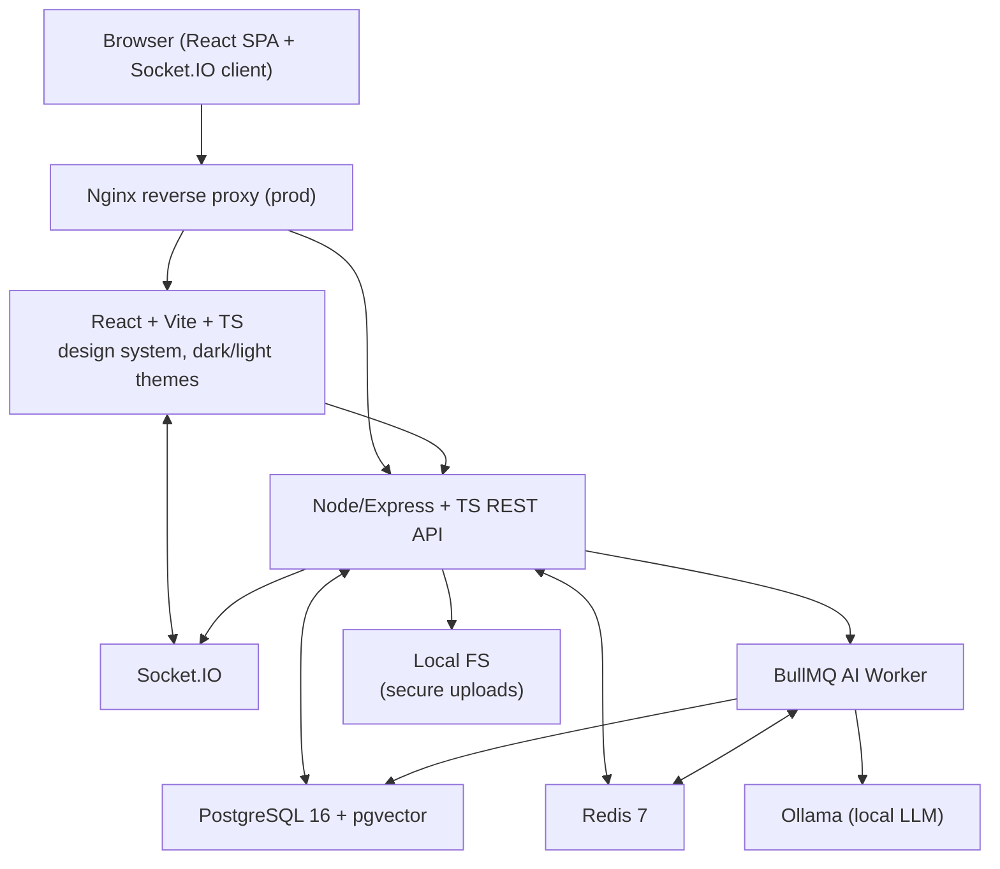
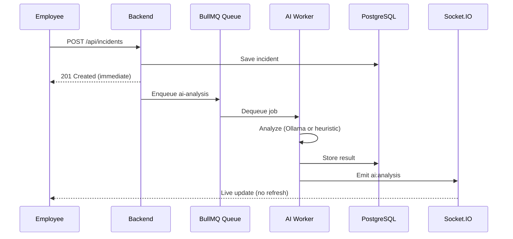

# Architecture

NexusOps follows a layered, service-oriented architecture designed for separation of concerns, testability, and horizontal scalability.

## High-Level Overview



## Layered Backend

```
HTTP Request
    │
    ▼
┌─────────────────────────────────┐
│  Routes         (URL mapping)   │
├─────────────────────────────────┤
│  Middleware     (auth, validate,│
│                  rate-limit, log)│
├─────────────────────────────────┤
│  Controllers    (HTTP ↔ service)│
├─────────────────────────────────┤
│  Services       (business logic)│
├─────────────────────────────────┤
│  Repositories   (Prisma queries)│
├─────────────────────────────────┤
│  Prisma ORM     (type-safe SQL) │
└─────────────────────────────────┘
    │
    ▼
PostgreSQL
```

Business logic lives in **services**, never in route handlers. Repositories isolate persistence. Controllers only translate between HTTP and service calls — this makes every layer independently testable.

## Real-Time Architecture



## AI Layer Design

The AI layer is **fully abstracted** behind a `LlmProvider` interface:

| Provider | When used |
|---|---|
| `OllamaProvider` | When `AI_ENABLED=true` and Ollama is reachable |
| `MockProvider` | When AI is disabled — returns safe defaults |
| Heuristic fallback | When Ollama returns invalid output — keyword-based classification |

This ensures the application **never breaks** without AI. The core software is strong on its own; AI is an enhancement.

## Security Layers

```
Request → Helmet (secure headers)
       → CORS check
       → Rate limiter
       → JWT verification
       → RBAC permission check
       → Zod input validation
       → Service logic
       → Audit log
```

## Scalability Considerations

| Component | Scaling strategy |
|---|---|
| Backend | Stateless — run multiple instances behind a load balancer |
| Socket.IO | Redis adapter enables multi-instance WebSocket broadcasting |
| PostgreSQL | Read replicas for analytics; connection pooling via PgBouncer |
| Redis | Sentinel for HA; Cluster for sharding |
| AI workers | Horizontal scaling — add more worker processes |

## Key Technical Decisions

| Decision | Rationale |
|---|---|
| PostgreSQL over MongoDB | Relational data with complex joins (incidents↔users↔assets↔SLA); ACID compliance for audit logs; pgvector gives vector search in the same DB |
| Redis over in-memory | Survives restarts; enables BullMQ job queue; pub/sub for multi-instance Socket.IO |
| Socket.IO over raw WS | Auto-reconnection, rooms, fallback transports, built-in auth handshake |
| BullMQ over bare Redis | Job retries, delayed jobs, job progress, concurrency control — production-grade |
| Prisma over raw SQL | Type-safe queries (SQL-injection safe by construction); first-class migrations; raw SQL escape hatch for pgvector |
| Local AI over cloud APIs | Zero cost; data never leaves the network; works offline; no vendor lock-in |
