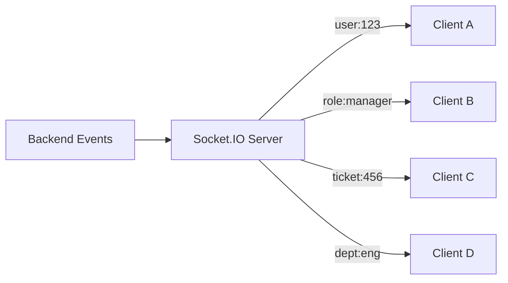
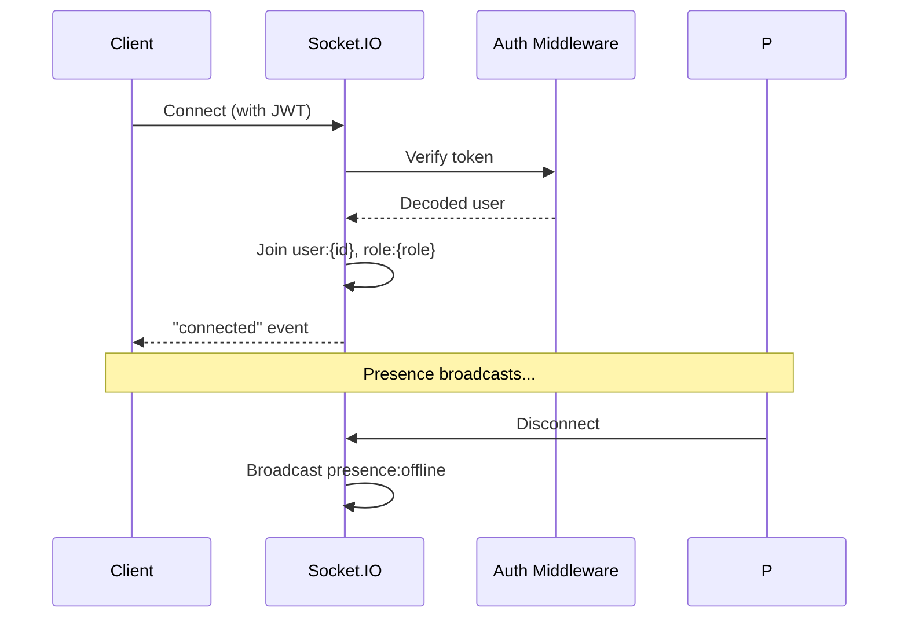
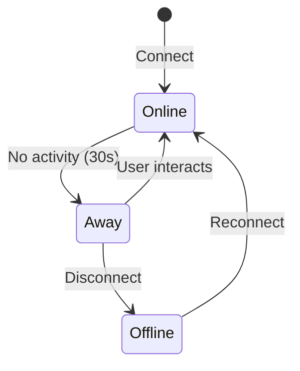
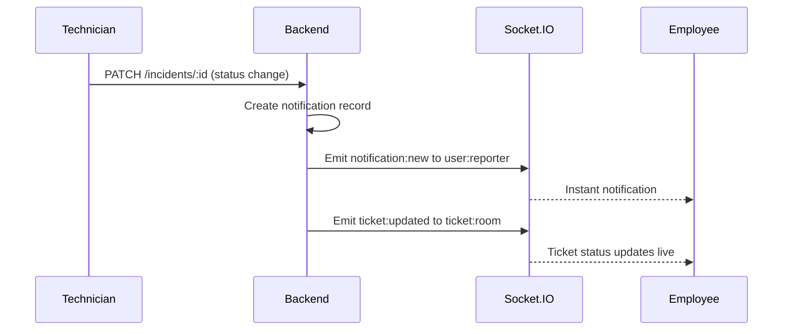

# Real-Time System

NexusOps uses **Socket.IO** over WebSockets to deliver live updates without page refreshes.

## Architecture



## Room-Based Routing

Events are scoped to **rooms** so only relevant clients receive updates:

| Room | Who joins | Purpose |
|---|---|---|
| `user:{userId}` | The user themselves | Personal notifications, AI results |
| `role:{role}` | All users with that role | Role-wide broadcasts (e.g., "new critical incident") |
| `ticket:{ticketId}` | Users viewing that ticket | Live comment/status updates |
| `department:{deptId}` | Members of a department | Department-specific events |

## Connection Lifecycle



### Authentication

The JWT is passed during the Socket.IO handshake (via `auth.token`). The middleware verifies it before allowing the connection. If the token expires mid-session, the client reconnects with a fresh token.

## Presence System

Users are shown with presence indicators:



| State | Indicator | Trigger |
|---|---|---|
| Online | 🟢 Green | Connected and active |
| Away | 🟡 Yellow | No mouse/keyboard for 30 seconds |
| Offline | ⚫ Gray | Disconnected |

The client sends periodic heartbeats. If the server misses 3 consecutive pings, the user is marked offline and broadcast to relevant rooms.

## Events Reference

### Server → Client

| Event | Payload | When |
|---|---|---|
| `ticket:created` | Incident summary | New incident created |
| `ticket:updated` | Changed fields + actor | Status/assignment/priority change |
| `ticket:comment` | Comment object | New comment added |
| `notification:new` | Notification object | New notification for user |
| `notification:unread_count` | `{ count: number }` | Read state changes |
| `ai:analysis` | Analysis result | AI job completes |
| `presence:update` | `{ userId, status }` | User goes online/offline/away |

### Client → Server

| Event | Payload | Purpose |
|---|---|---|
| `ticket:subscribe` | `{ ticketId }` | Join a ticket's room |
| `ticket:unsubscribe` | `{ ticketId }` | Leave a ticket's room |
| `presence:away` | — | Mark self as away |
| `presence:online` | — | Mark self as online |

## Notification Flow



## Scalability

For multi-instance deployments, Socket.IO supports the **Redis adapter**:

```typescript
import { createAdapter } from '@socket.io/redis-adapter';

io.adapter(createAdapter(pubClient, subClient));
```

This allows events to propagate across all backend instances, so a user connected to instance A receives events published by instance B.

## Fallback Behavior

If WebSockets are unavailable (e.g., corporate firewall), Socket.IO automatically falls back to **HTTP long-polling**. The user experience degrades gracefully — updates still arrive, just with slightly higher latency.

## Connection Resilience

- **Auto-reconnection**: Socket.IO reconnects automatically with exponential backoff
- **Token refresh**: If the access token expires mid-session, the client refreshes it and reconnects
- **Event buffering**: Events sent while disconnected are not lost — the server emits them on reconnect for subscribed rooms
