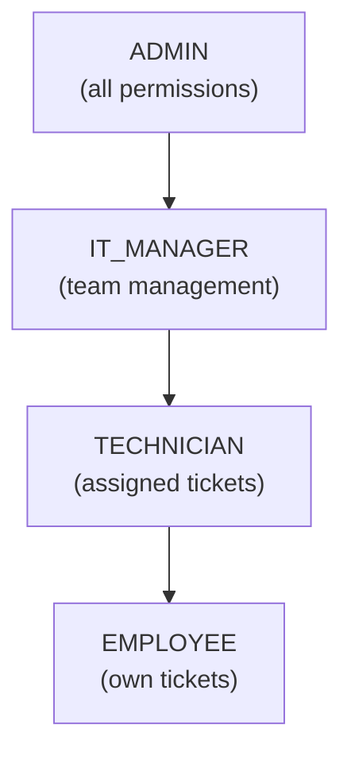

# Security

Security is a first-class concern in NexusOps. This document covers the defense-in-depth strategies employed.

## Defense Layers

```
Request → Helmet (secure headers)
       → CORS check
       → Rate limiter
       → JWT verification
       → RBAC permission check
       → Zod input validation
       → Service logic
       → Audit log
```

## Authentication

### Password Hashing
- **bcrypt** with cost factor **12** (~250ms per hash on modern hardware)
- Passwords are never logged or returned in any response
- Minimum length enforced via Zod (8+ characters)

### JWT Tokens
| Token type | Lifetime | Storage | Purpose |
|---|---|---|---|
| Access token | 15 minutes | localStorage | API authorization |
| Refresh token | 7 days | localStorage | Obtain new access tokens |

### Token Rotation
On each refresh, the old refresh token is **revoked** and a new one issued. This prevents token theft from being useful long-term. The backend stores a SHA-256 hash of refresh tokens — if the database is compromised, attackers cannot use the hashes directly.

### Account Lockout
Failed login attempts are tracked. After **5 consecutive failures**, the account is temporarily locked for **15 minutes** (configurable).

## Authorization (RBAC)

NexusOps uses **Role-Based Access Control** with granular permissions:



Every API endpoint verifies authorization server-side. Frontend restrictions are for UX only — **the backend is authoritative**.

## Input Validation

All inputs are validated using **Zod** schemas before reaching service logic:

```typescript
const CreateIncidentSchema = z.object({
  title: z.string().min(5).max(200),
  description: z.string().min(10).max(5000),
  priority: z.enum(['LOW', 'MEDIUM', 'HIGH', 'CRITICAL']),
  category: z.enum(['NETWORK', 'HARDWARE', /* ... */]),
});
```

This prevents:
- **SQL injection** (Prisma uses parameterized queries; Zod adds a second layer)
- **XSS** (input is sanitized; React escapes by default)
- **Mass assignment** (only whitelisted fields are accepted)

## Rate Limiting

| Route group | Limit | Window |
|---|---|---|
| `/api/auth/*` | 10 requests | 15 minutes |
| `/api/*` (authenticated) | 100 requests | 1 minute |
| `/api/uploads/*` | 20 requests | 1 minute |

Rate limiting uses Redis for distributed state, so it works across multiple backend instances.

## HTTP Security Headers (Helmet)

| Header | Value | Purpose |
|---|---|---|
| `Content-Security-Policy` | `default-src 'self'` | Prevents XSS via resource loading restrictions |
| `Strict-Transport-Security` | `max-age=31536000` | Forces HTTPS |
| `X-Content-Type-Options` | `nosniff` | Prevents MIME sniffing |
| `X-Frame-Options` | `DENY` | Prevents clickjacking |
| `X-XSS-Protection` | `0` | Disabled in favor of CSP |

## CORS Configuration

```typescript
// In production, only the frontend origin is allowed
app.use(cors({
  origin: env.CORS_ORIGIN,  // e.g., https://nexusops.example.com
  credentials: true,
}));
```

## File Upload Security

| Measure | Implementation |
|---|---|
| Size limit | 10 MB per file |
| Allowed types | Images (PNG/JPG/GIF/WEBP), PDF, TXT, DOCX, XLSX |
| Magic byte validation | Reads first 4 bytes to verify MIME type — **not just extension** |
| Filename sanitization | Original name sanitized; stored as UUID to prevent path traversal |
| Storage location | Outside web root; served via authenticated download endpoint |
| Virus scanning | Ready for ClamAV integration (placeholder in service) |

### Magic Byte Checking

```typescript
const SIGNATURES = {
  'image/png': [0x89, 0x50, 0x4E, 0x47],
  'image/jpeg': [0xFF, 0xD8, 0xFF],
  '%PDF': [0x25, 0x50, 0x44, 0x46],
};

function verifyMagicBytes(buffer: Buffer, claimedMime: string): boolean {
  const expected = SIGNATURES[claimedMime];
  if (!expected) return false;
  return expected.every((byte, i) => buffer[i] === byte);
}
```

## Audit Logging

Every security-sensitive action is recorded in the **audit_logs** table:

- User authentication (login, logout, failed attempts)
- User management (create, role change, disable)
- Incident operations (create, update, delete)
- File uploads and downloads
- Permission changes
- AI decisions (accept/reject recommendations)

Audit logs are **INSERT-only** — even admins cannot modify them. They include:
- Actor ID
- Action type
- Entity type and ID
- Timestamp
- IP address
- User agent

## Error Handling

```typescript
// Production: never leak stack traces
if (env.NODE_ENV === 'production') {
  return res.status(500).json({
    success: false,
    message: 'An unexpected error occurred',
    code: 'INTERNAL_ERROR',
  });
}
```

Internal errors are logged server-side (with full stack trace) but **never returned to the client**.

## Secrets Management

| Secret | Storage |
|---|---|
| JWT secrets | Environment variables |
| Database password | Environment variables |
| Encryption key | Environment variables (32-byte hex) |
| API keys (if any) | Environment variables |

A `.env.example` is provided with **no real secrets**. The actual `.env` is gitignored.

## Security Checklist

- [x] Password hashing (bcrypt)
- [x] JWT with rotation and revocation
- [x] RBAC with server-side enforcement
- [x] Input validation (Zod)
- [x] Rate limiting
- [x] Secure headers (Helmet)
- [x] CORS configuration
- [x] SQL injection prevention (Prisma + Zod)
- [x] XSS prevention (React escaping + CSP)
- [x] CSRF protection (SameSite cookies + CORS)
- [x] Secure file uploads (magic bytes, size limits)
- [x] Audit logging (immutable)
- [x] Error handling (no stack traces leaked)
- [x] Secrets in environment variables
- [x] HTTPS enforcement (HSTS)
